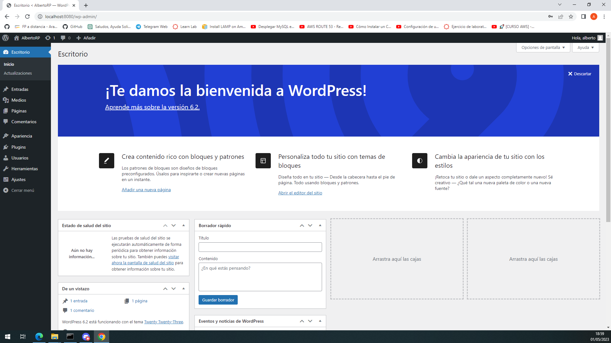
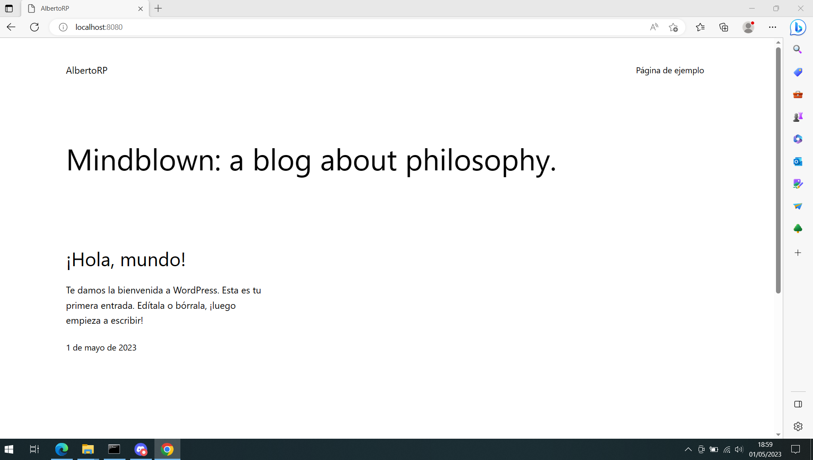

# Practica-3-Wordpress-con-docker-compose
DAW
* Crear la maquina virtual de vagrant.

* Instalar docker-compose, en Vagrantfile añadimos las siguientes lineas:
        ```
        config.vagrant.plugins = "vagrant-docker-compose"
        config.vm.provision :docker
        config.vm.provision :docker_compose,  yml: "/vagrant/docker-compose.yml", rebuild: true, run: "always"
        ```
* Además necesitamos redigigir los puertos para conectar.
    ```
    config.vm.network "forwarded_port", guest: 80, host: 8080
    config.vm.network "forwarded_port", host: 3306, guest: 3306
    ```

* Crear el archivo docker-compose.yml en el directorio donde vamos a tener la máquina virtual.
    * Contenido del archivo:
        ```
        version: '3.1'
        services:
        wordpress:
            container_name: servidor_wp
            image: wordpress
            restart: always
            environment:
            WORDPRESS_DB_HOST: db
            WORDPRESS_DB_USER: user_wp
            WORDPRESS_DB_PASSWORD: asdasd
            WORDPRESS_DB_NAME: bd_wp
            ports:
            - 80:80
            volumes:
            - wordpress_data:/var/www/html/wp-content
        db:
            container_name: servidor_mysql
            image: mariadb
            restart: always
            environment:
            MYSQL_DATABASE: bd_wp
            MYSQL_USER: user_wp
            MYSQL_PASSWORD: asdasd
            MYSQL_ROOT_PASSWORD: asdasd
            volumes:
            - mariadb_data:/var/lib/mysql
        volumes:
            wordpress_data:
            mariadb_data:
        ```
* Vamos al directorio donde tenemos el archivo .yml
    ```
    cd /vagrant/
    ```
* Crear los escenarios
```
docker-compose up -d
```
* En nuestro ordenador ya podemos acceder a traves de la siguiente url:
    ```
    http://localhost:8080
    ```
* CAPTURAS
    
    